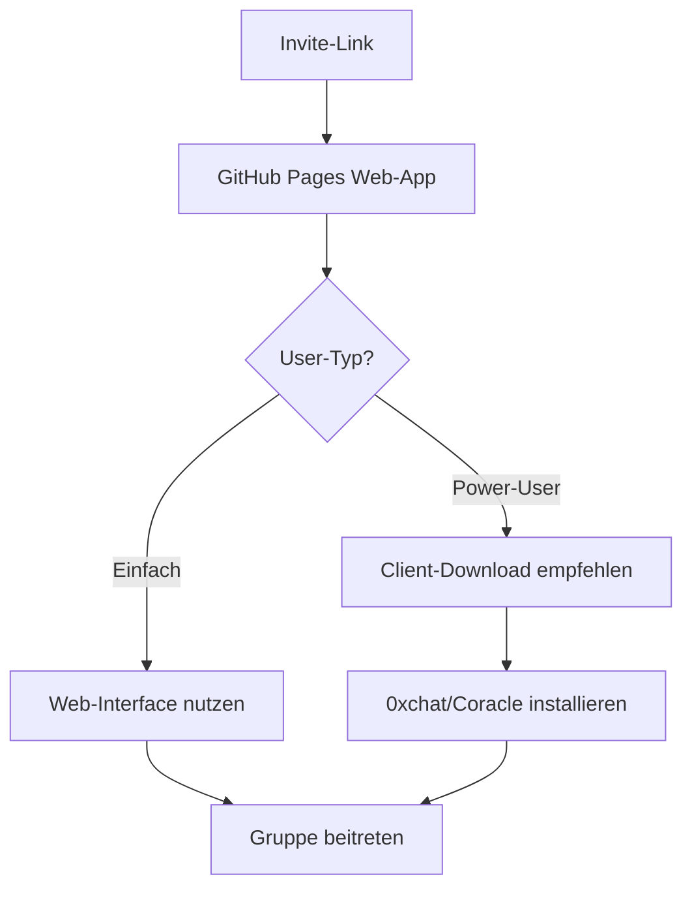

# 🌐 NOSTR GRUPPEN ZUGANG - Optionen Vergleich

## 🎯 **Deine Situation:**
Du hast eine **private Nostr-Gruppe** und willst den einfachsten Zugang für neue Mitglieder.

---

## 📱 **Option 1: Nostr-Clients (0xchat, Coracle, Amethyst)**

### ✅ **Vorteile:**
- **Native NIP-29 Unterstützung** - alle Group-Features
- **Optimale Performance** - direkte Relay-Verbindung
- **Vollständige Funktionalität** - alle Nostr-Standards
- **Offline-Fähigkeit** - lokale Schlüsselspeicherung

### ❌ **Nachteile:**
- **Installation erforderlich** - Hürde für neue User
- **Lernkurve** - Nostr-Konzepte verstehen
- **Begrenzte Verbreitung** - nur Tech-affine User
- **Verschiedene UIs** - inkonsistente Erfahrung

### 🔗 **Zugang:**
```
1. Client installieren (0xchat, Coracle, etc.)
2. Nostr-Schlüssel importieren/erstellen
3. Relay hinzufügen: wss://nostr-relay.online
4. Gruppe mit Invite-Code beitreten
```

---

## 🌐 **Option 2: GitHub Pages Web-App**

### ✅ **Vorteile:**
- **Sofortiger Zugang** - nur Link anklicken
- **Keine Installation** - läuft im Browser
- **Größere Reichweite** - jeder kann beitreten
- **Konsistente UI** - deine eigene Oberfläche
- **Mobile-freundlich** - responsive Design

### ❌ **Nachteile:**
- **Limitierte NIP-29 Features** - nicht alle Standards
- **Browser-Abhängigkeit** - JavaScript erforderlich
- **Weniger Performance** - Web-basierte Beschränkungen
- **Komplexere Entwicklung** - mehr Code erforderlich

### 🔗 **Zugang:**
```
1. Link anklicken: https://walpurga03.github.io/Bitcoin-Tausch-Netzwerk/group.html#join/BTN_ABC123
2. Mit Nostr-Wallet anmelden (Alby, Amber)
3. Nickname eingeben
4. Sofort in der Gruppe
```

---

## 🎯 **Meine Empfehlung: HYBRID-ANSATZ**

### 🌉 **Web-App als Einstiegspunkt + Client-Option**



### 🚀 **Implementation:**

#### 1. **GitHub Pages als Landing**
```html
https://walpurga03.github.io/Bitcoin-Tausch-Netzwerk/group.html#join/BTN_ABC123

👆 Jeder kann sofort beitreten
```

#### 2. **Client-Option für Power-User**
```javascript
// In der Web-App
if (detectNostrClient()) {
    showClientRecommendation();
    // "Du hast 0xchat! Möchtest du dort weitermachen?"
}
```

#### 3. **Cross-Platform Funktionalität**
- **Web-App**: Basis-Features (Chat, Angebote)
- **Clients**: Erweiterte Features (Multi-Relay, etc.)
- **Sync**: Beide nutzen dieselben Nostr-Events

---

## 📊 **Technische Umsetzung für GitHub Pages:**

### 🔧 **Was funktioniert:**
- ✅ **NIP-01** - Basic Events (Chat-Nachrichten)
- ✅ **NIP-17** - Private Messages (DMs)
- ✅ **NIP-07** - Browser Extensions (Alby, Amber)
- ✅ **Custom Events** - Gruppen-Simulation

### ⚠️ **Was limitiert ist:**
- ❌ **Echtes NIP-29** - komplexe Group-Features
- ❌ **Multi-Relay** - nur wenige Relays praktikabel
- ❌ **Offline-Mode** - Browser-Beschränkungen

### 💡 **Lösung: Hybrid-Implementation**
```rust
// Rust Backend simuliert NIP-29 Groups
// Web-Frontend nutzt Standard Nostr-Events
// Clients können echte NIP-29 nutzen
```

---

## 🎯 **Konkrete Empfehlung für DICH:**

### 🌟 **GitHub Pages Web-App ZUERST**

**Warum:**
1. **🚀 Schneller Start** - sofort verfügbar
2. **📈 Größere Adoption** - keine Hürden
3. **🎨 Eigene Brand** - dein Design
4. **📱 Mobile-Ready** - alle Geräte

**Dann später:**
1. **📦 Client-Integration** - 0xchat Support
2. **🔗 Deep-Links** - nahtloser Übergang
3. **⚡ Power-Features** - für erfahrene User

### 🛠️ **Next Steps:**

1. **Web-App finalisieren** (fast fertig!)
2. **Invite-System testen** 
3. **Mobile-Optimierung**
4. **Client-Integration planen**

---

**💬 Was denkst du? Web-App als Hauptzugang + Client-Option für später?**
